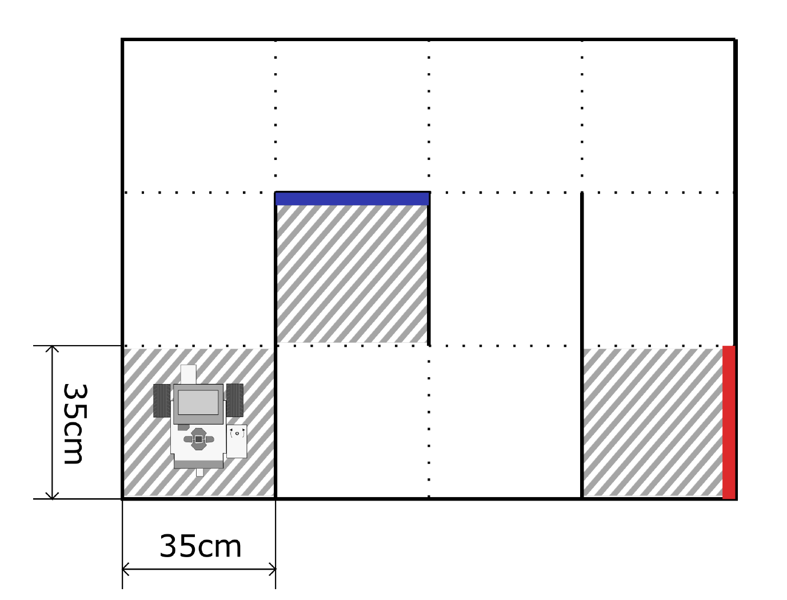

# MAZE CHALLENGE

In the Maze Challenge a LeJos Robot is placed in an undisclosed maze. The goal is to find a target wall
with a specified color within the maze. The target color (red, green, and blue) can be selected in a menu after the program starts.
Once the color is selected, the robot should start search the maze for the correspondingly colored wall.

Sample Maze:

